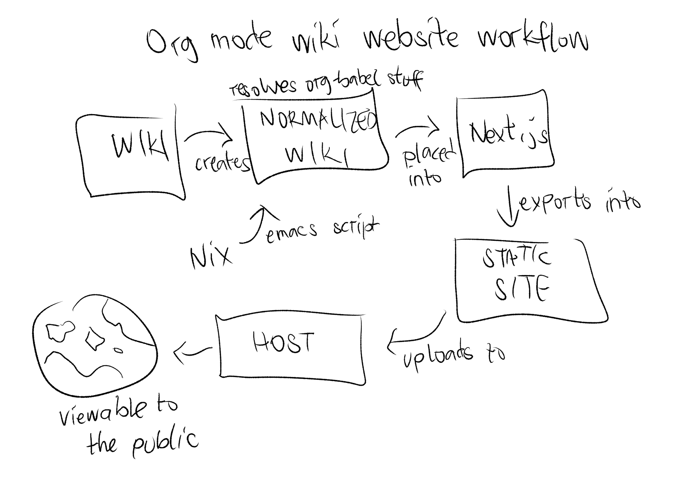

= foo-dogsquared's wiki
:toc: true

:art-file-prefix: fds-visual

Keep taking notes and stop worrying about file organization!

Muh wiki.
This documents the "infrastructure" of my notes because I like documenting and I always forget things.
It primarily uses the link:https://zk.zettel.page/[Zettelkasten note-taking method] which means all of my notes are scattered in just one location.
Fun.

Slowly, this is turning into a monorepo for whatever findings I could find.
Ehh, I mean why not? ¯\\_(ツ)_/¯

[NOTE]
====
On another note, this supersedes my link:https://github.com/foo-dogsquared/personal-notes[personal notes].
I'm not going to import them because I want to start on a clean slate.

Also, not everything on this Git repo is here (at least yet).
Some of them are private files and so I want them to not appear anywhere else.
Fortunately for me, most of the private files are connected with each other (a separate org-roam instance would be better in this case).
====

== Why set up like this?

We need to focus on why did I need to make the structure like this.
In other words, **what is the purpose**?

- I want ideas to be searched and woven so easily with the rest.
- I want to accumulate my reading effectively.
- I'm not an expert so I still need the "basic" way of taking structured notes, summarizing them until I gain a bigger picture of the things I'm curious about.
- I want to easily integrate spaced repetition and randomness to encourage improvement on my notes.

This project is the result of that with org-roam, Anki, and eventually more (preferably less) tools to stick around and gain ideas from.
In a way, THIS is my zettelkasten, digital garden, whatever-thingamajig-you-want-to-call-it.

== Getting started

Interested in copying my setup?
Here's my IKEA-esque manual for you.

=== Prerequisites

It needs the following list of software.
All of them are required unless noted otherwise.

* link:https://www.gnu.org/software/emacs/[GNU Emacs] because link:https://orgmode.org/[org-mode].

** Uses link:https://github.com/hlissner/doom-emacs/[Doom Emacs] as the preferred Emacs distro with the `org` module enabled.
This is optional and you can use your own Emacs config.

** link:https://github.com/org-roam/org-roam[org-roam] v2, the star of the show, is installed.

* link:https://nixos.org/[Nix package manager] because link:https://orgmode.org/manual/Working-with-Source-Code.html[org-babel].
You can fully replicate the environment without Nix by looking at the dependencies at link:./shell.nix[`./shell.nix`] and install them with your package manager (or anything else, you do you) but I recommend to do so because I say so.

* link:https://direnv.net/i[direnv] (optional, by the way) because automatic shell environment.
footnote:[You can enable the direnv module from the Doom Emacs config.]

=== Setting up

This wiki uses org-roam v2 as the main note-taking system.
As of 2021-05-04, it is yet to reach v2 but it is underway with its link:https://github.com/org-roam/org-roam/releases/tag/2.0.0a1[first alpha release].
The notes should've been adapted for v2 by now.
Though, you have to configure it in line with the major redesign.

If you want to fully reproduce the config, refer to my Doom Emacs configuration.

Now with the pieces complete and assuming you've already have my wiki in your folder, fire up Emacs, open the wiki folder, and do your thing.
This project has a link:./.dir-locals.el[local Emacs config] (see link:https://www.gnu.org/software/emacs/manual/html_node/emacs/Directory-Variables.html[related section]).
It also has a project-specific functions and variables in link:./config.el[`./config.el`].
You can load it in your `init.el`, just make sure you included it somewhere.
If you've set `enable-local-variables` to `:safe` or any value that makes Emacs to ignore them, you may want to configure related variables for it to work.

If you have direnv installed, you can also enable automatic shell environments by allowing it to set it up for you.
Just run `direnv allow`!

If you have link:https://github.com/target/lorri[lorri] installed, you're better to go with the faster startup when setting up the environment.

== Project structure

Here's the current project structure.

[src, tree]
----
wiki
├── assets/
├── cards/
├── daily/
├── structured/
├── *a bunch of org documents*
├── config.el
├── index.org*
├── Makefile
├── README.adoc
├── references.bib
└── shell.nix
----

For full details, see <<Conventions>>.
But for summary:

* Separate notes by purpose.
Separate as may be, they can freely link other notes.

* Evergreen notes are the top-level notes.

* Each type of note has an asset folder where all of the stuff linked from the note.

== Conventions

* There are certain times to use custom link:https://orgmode.org/manual/Blocks.html[Org mode blocks] inspired from Asciidoctor.

** Abstract — e.g., `#+begin_abstract`.
** Appendix — e.g., `#+begin_appendix`.
** link:https://docs.asciidoctor.org/asciidoc/latest/blocks/admonitions/[Admonition blocks] — e.g., `\#+begin_important`, `#+begin_tip`, `#+begin_warning`.

* Mainly uses https://zk.zettel.page/types-of-notes[the convention of note categories found in zk.zettel.page].
But in practice, the separation is a bit blurry so feel free to combine them in some way.
+
The entire point is separating the notes by purpose.
That said, just don't sweat it too much when you find something that doesn't belong there.
Ask yourself if a note really serves its intended purpose.

** Fleeting notes are in link:./daily/[`./daily/`].
The fleeting notes are ignored since they're meant to processed on the daily so having them in the worktree will make a messy history.
It is basically my inbox for various things: my random realizations, ideas, and whatnot.

** My "traditional" notes is at link:./structured/[`./structured/`].
Practically, this is your 2D system of notes — the hierarchical notebook.
All notes here are named with the safe version of the filename (in kebab-case).
The filename is also just the normal path name except with the directory separator replaced with the dot (e.g., `cookbook/introduction-to-builder-pattern.org` will be `cookbook.introduction-to-builder-pattern.org`).
This allows to make a directory of flat files while representing the schema of your notes.
Pretty handy.

** Literature notes are in my hierarchical notebooks.
The file name are prefixed with `literature`.
These are notes from a specific resource (e.g., an article, talk, video, post, tweet) intended for recording the key ideas from it.
Eventually, the ideas will be added to the evergreen notes.
Furthermore, they shouldn't be referenced anywhere.
Naming them is the same as the one in my traditional notes.

** The root folder contains my evergreen notes.
These are essentially like my Zettelkasten, a bunch of my own ideas (that I have processed and realized myself, anyways).
footnote:[Not necessarily original but just some of them being developed and processed, with/out a Eureka moment.]

** For challenges and answers to problem sets, they are set in my hierarchical notebook with the prefix `challenges`.
The conventions are each question are its own section and are copied verbatim (as much as possible) with my solution as a subsection.
I may also make some additional comments and subsections with my findings after peeking at the solution.

** Additional types of notes can be put in a separate folder (e.g., cards, microposts).
There is not set hierarchy but be sure to create a new type by purpose.

* The above structure makes it easier for retrieval.
If you want to search all of the fleeting notes, just search in `daily/`, etc.

** For searching tools, prefer desktop search tools such as link:https://www.lesbonscomptes.com/recoll/[Recoll] or link:https://sourceforge.net/projects/docfetcher/[DocFetcher].
** Quick search tools such as grep or link:https://github.com/BurntSushi/ripgrep[ripgrep] are also nice.

* Uses timestamp (at localtime) as the filename, it is unique enough (for personal purposes) and doesn't need to change.
footnote:[If you use the title as the basis, that'll depend if you have tolerance for the misaligning relation between the filename and the title.]
The format for the filename is equivalent to `$(date +%F-%H-%M-%S).org`.

* Since org-roam v2, an ID is now required to be recognized by the software.
File-level notes should have a top-level property drawer with an ID set while certain entries have local property drawers.
That said, be selective when to assigning IDs for the local headlines.

* Uses link:https://orgmode.org/guide/Tags.html[plain org-mode tags] for consistency.
It also happens to be the only supported tag format starting from link:https://org-roam.discourse.group/t/org-roam-major-redesign/1198[org-roam v2] so hoorah for me. :)

* A list of references are stored at link:./references.bib[`./references.bib`] for link:https://github.com/jkitchin/org-ref[org-ref-styled workflows].
It is managed with link:https://www.zotero.org/[Zotero] with the link:https://github.com/retorquere/zotero-better-bibtex[better-bibtex Zotero extension] but you can replace however you manage and generate the Bibtex file.

* A creation datetime and a modification datetime is a cruicial part of my notes.
It lets me know how up-to-date my notes are without relying on the filesystem metadata because I copy them carelessly, not to mention how various tools deal with them differently.
The modification datetime is handled with link:https://www.gnu.org/software/emacs/manual/html_node/emacs/Time-Stamps.html[timestamps] automatically.
+
Just see my link:https://github.com/foo-dogsquared/dotfiles/tree/75de71b4d0dfe79fe820204e365809cee11d7349/emacs[Doom Emacs config] in my dotfiles.
+
[source, elisp]
----
(after! org
  (setq
   time-stamp-start "date_modified:[ 	]+\\\\?[\"<]+"
   time-stamp-format "%Y-%02m-%02d %02H:%02M:%02S %:z"))

; Automate updating timestamps on save.
(add-hook 'before-save-hook 'time-stamp)
----

* The related assets are stored in the link:./assets/[`./assets/`].
It contains anything that a document should attach.
Each note should have its own asset folder with no note touching another notes'.
The asset folder names should be the same as the filename of the org-mode document — e.g., `2021-04-06-15-04-11.org` should have an asset folder in `./assets/2021-04-06-15-04-11/`.

** If one of the files is being linked from more than one note, you can move the file out in the top-level of the asset folder.

** I sometimes draw a visual aid just to strengthen my learning as well as an excuse to use my graphics tablet and I want to store them in a reasonable location without dumping it like in a landfill.
Unfortunately, this means having to scour the assets folder like a clueless babboon holding a hammer because all of it is named after a timestamp but I can deal with it.

** link:https://orgmode.org/worg/org-contrib/babel/intro.html[org-mode can also generate files including text and graphics].
I'm lazy and I fear conflicting asset filenames so I'll just put them in separate folders instead alongside opening a can of worms.
footnote:[This includes trying to name an asset that doesn't exist already to not overwrite the file that one note needed. It's also a lot more subtle when trying to build it altogether or if the notes get any bigger.]

** For my hand-drawn visual aids, I usually name with a prefix (e.g., `{art-file-prefix}-${WHAT_THE_GRAPHICS_IS_ABOUT}.webp`).
As a side effect, this mitigates against overwriting of generated assets from org-mode if I remember to not name it `{art-file-prefix}-*`.

** If you enable local variables (recommended to query it) and are OK with prompts every time you open up a note, then this should be no problem for you.

== Static site export

While the wiki is exclusively used with Emacs, there is an exported website with Next.js and link:https://github.com/rasendubi/uniorg/[uniorg] deployed using GitHub Actions (at link:./.github/workflows/[`./.github/workflows/`]).
The source code of the site is at link:./site/[`./site/`].

Here's the image summarizing the workflow.

== Future tasks

This also means expect the following changes if you're watching this repo for some reason.
Keep in mind all of the details are still under consideration.

* Create a static site for my wiki.
org-roam doesn't have a built-in export option yet but there are solutions.
For now, I'm not worrying to much on this one.

** I could make a custom publication script.
I did create a publication script back then for a small org-mode-based for testing purposes but it is messy and life happened so I wasn't able to get back on it immediately.
Here's a link:https://git.sr.ht/~brettgilio/website/[very good example of a org-mode-and-Emacs-powered site] complete with features and without JavaScript!
footnote:[link:https://brettgilio.com/[Brett Gilio] is kind enough to answer my noob org-mode related questions back then so big thanks to him for the guidance. :)]
The advantage is complete control and the disadvantage is starting from scratch.
Still, you can start from already existing solutions.

** Convert the org documents to commonly-supported text formats like Markdown and use static site generators.
Most of them supports Markdown and there is an "export to Markdown" option for org-mode.
I could whip up an Elisp script and export it by batch then move them over to an SSG setup like Hugo.
This is also how link:https://github.com/jethrokuan/braindump[Jethro Kuan's org-roam notes] are setup.

** Use a parser outside of Emacs.
link:https://github.com/rasendubi/uniorg/tree/master/examples/org-braindump[uniorg] has a good example with Next.js as the site generator and it can support org-roam v2 ID links.
It requires an external JavaScript-based setup but it can also be an advantage.

* Try out link:https://github.com/srid/neuron/[Neuron].
I've used it on and off and even tried to support both org-roam and Neuron because I like the static site generated and also because org-roam doesn't have a killer HTML exporter yet (in my opinion).
It is simple and nice but I can deviate from that with link:https://orgmode.org/manual/Publishing.html[org-publish] or any supported static site generators like link:https://gohugo.io/[Hugo].
Once link:https://github.com/srid/neuron/issues/557[org-mode is reimplemented in Neuron v2], it's a 100% addition to my workflow.

* Support graphing features.
org-roam has link:https://github.com/org-roam/org-roam-server[org-roam-server] plugin but as of 2021-05-07, it doesn't v2.
Not a necessity, necessarily, but it is a good visual way to quickly glance how my notes are doing in the bigger picture.
Also, the ultimate procastination tool.

* Add/replace Nix with link:https://guix.gnu.org/[Guix].
Maybe add a file intended for setting up a Guix environment.
I like both Nix and Guix, all right.

